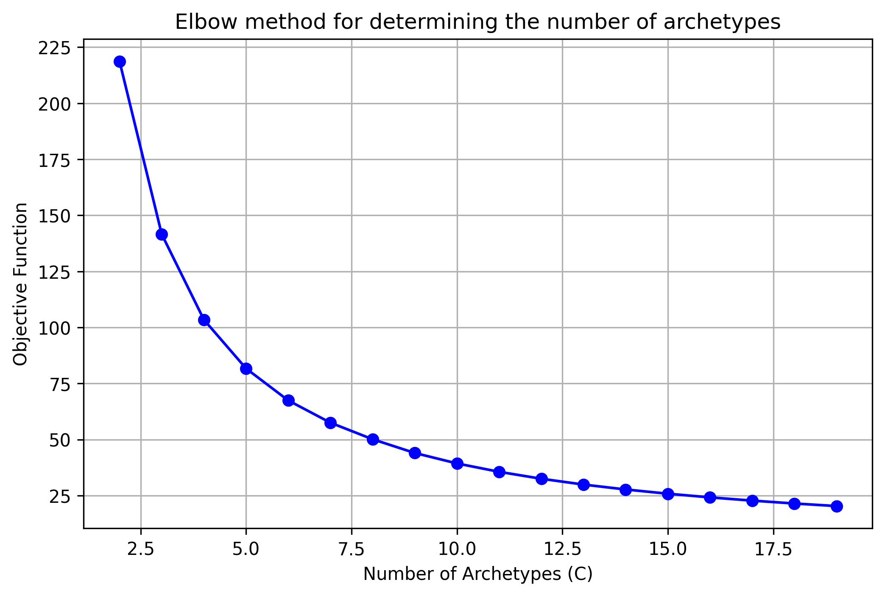
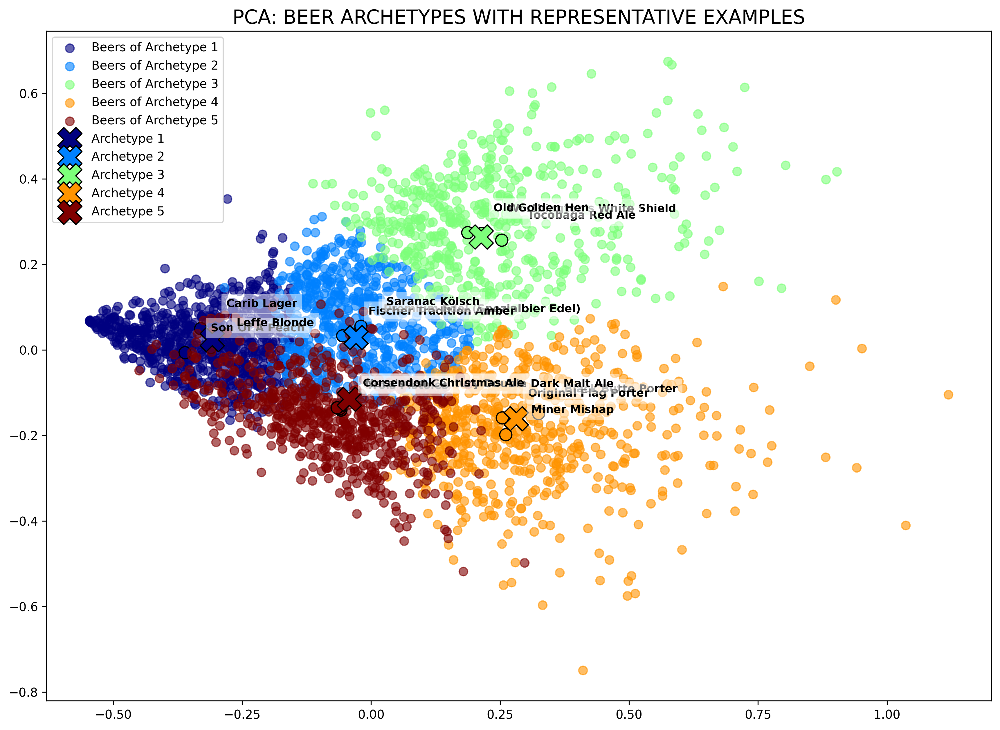
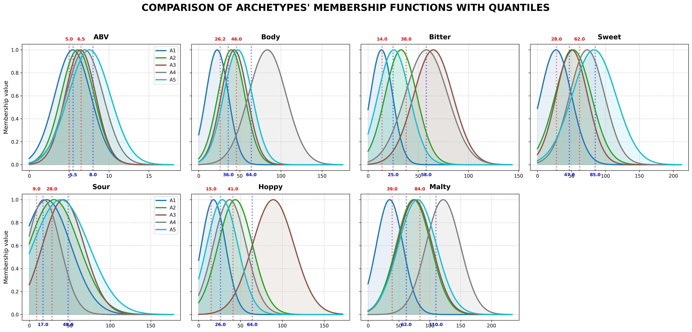
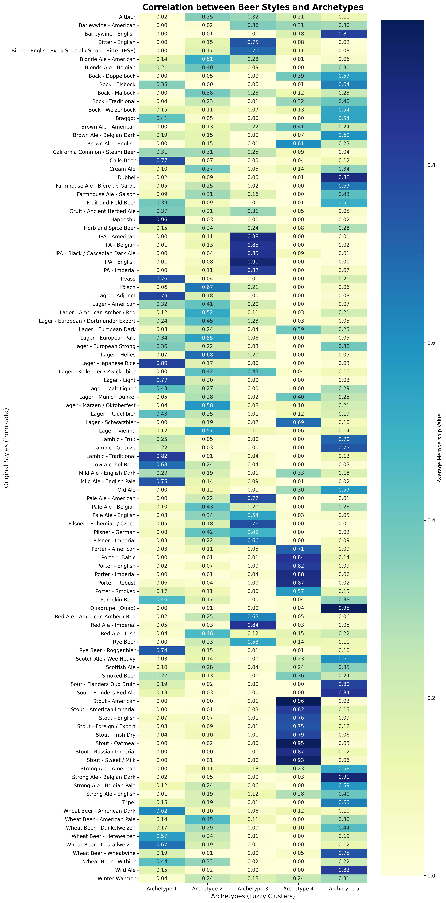

# Beer Archetype Discovery System

An end-to-end Knowledge Discovery pipeline using Fuzzy C-Means to extract linguistic rules from sensory beer data.

## 🚀 Executive Summary
This project demonstrates an end-to-end Knowledge Discovery pipeline that transforms raw sensory data into a human-readable expert system. By combining unsupervised machine learning (Fuzzy C-Means) with statistical validation, the system identifies hidden "archetypes" in craft beer profiles and extracts linguistic logic without human bias.

Core Technical Value:

Robust Clustering: Implemented Fuzzy C-Means (FCM) with a Random Restart strategy and objective function minimization to ensure global convergence.

Numerical Stability: Engineered a Log-Sum-Exp activation logic to prevent arithmetic underflow during high-dimensional Product T-norm calculations.

Knowledge Extraction: Developed an adaptive mechanism to derive Gaussian Membership Functions and linguistic IF-THEN rules from discovered cluster centroids.

Model Fidelity: Validated the rule-based approximation against the original FCM model using Pearson Correlation (r > 0.90) and Mean Absolute Error (MAE), ensuring high-accuracy knowledge representation.

## 📊 Visualizations





## 🛠️ Project Structure
- `src/`: Core Python implementation.
- `data/`: Dataset used for training and validation.
- `docs/`: Documentation (PDF).
- `img/`: Saved plots. 

## ⚙️ Installation & Usage
1. Clone the repository:
   ```bash
   git clone https://github.com/icydingo29/beer-archetype-discovery.git

2. Install dependencies:
   ```bash
   pip install -r requirements.txt

3. Run the analysis:
   ```bash
   python -m src.main

## 🧪 Methodology
Clustering: Fuzzy C-Means (FCM) with Random Restarts.

Rule Extraction: Adaptive Gaussian Membership Functions.

Validation: Pearson Correlation and MAE.

## 📜 License
This project is licensed under the MIT License.